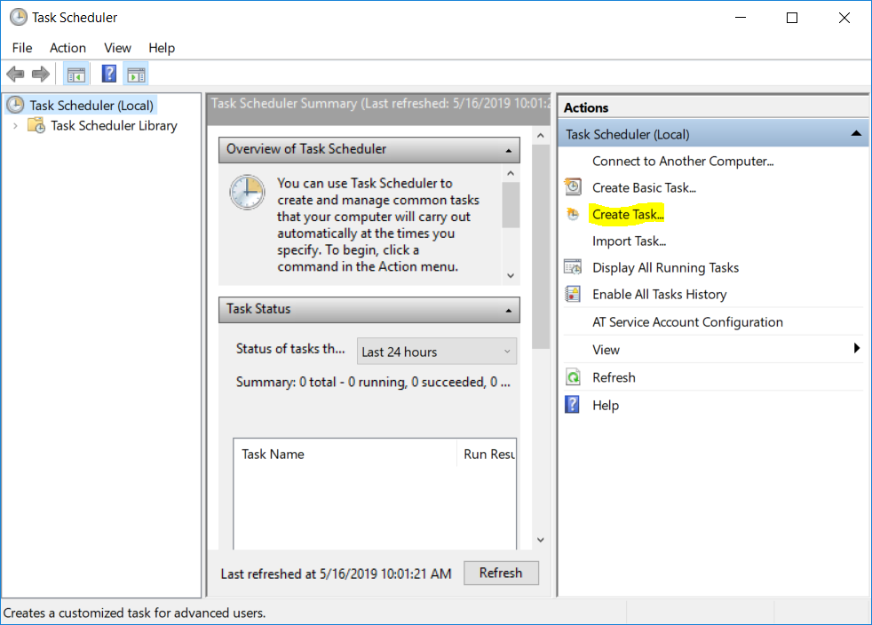
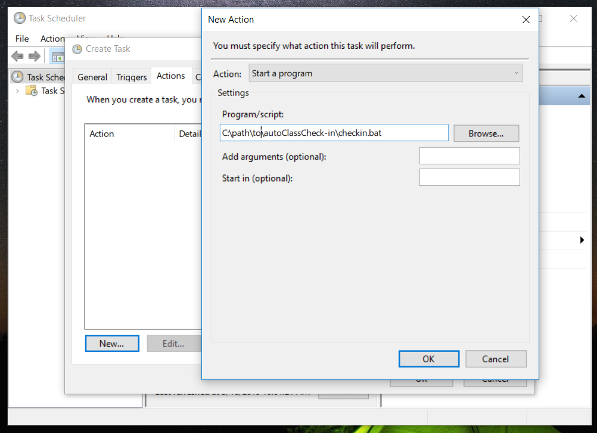

# BootCamp Check-in
> Auto check-in to bootcampspot.com


Do you forget to check-in when you go to your class that uses bootcampspot.com? Use this code to auto check-in to class by running the .bat file with a task scheduler(Windows). Just set the trigger as the time you are supposed to be in class, with a conditional that the school wifi is available.


## Installation

Windows:
- Clone this repository to a local directory
- cd to the directory where requirements.txt is located.
- Activate your virtualenv.
- Run: 
```sh
pip install -r requirements.txt
```
in your shell

- Edit the .bat file with the path to your installation of Python and to checkin.py 


- Setup task scheduler to run program at the beginning of class. 

- First create a new task


- Give the task a name


- Under triggers, add a schedule for your task. Multiple triggers can be added.


- Set the action as the path to checkin.bat


- Set any conditions. I set mine to check for the school wifi before running


The first time the program runs you will be asked for your username/email and password. You will only be asked for this info once.

You're all set!


## Release History
* 0.9
   * Added GUI
* 0.0.1
    * Work in progress

## Meta

Joseph Villavicencio – [@Hone1er](https://twitter.com/hone1er)

    
                    GNU AFFERO GENERAL PUBLIC LICENSE
                       Version 3, 19 November 2007
